

  <h2 align="center">
    
      Top-AI-Conferences-Paper-with-Code
  </h2>

  	
  
  
   	
  	
    
     

##  Motivation

This repository is a collection of AI top conferences papers (e.g. ACL, EMNLP, NAACL, COLING, AAAI, IJCAI, ICLR, NeurIPS, and ICML) with **open resource code**.

As we all know, it is very difficult for a paper to describe every implement detail within a limited number of pages. A work with open resource code offers us more information and makes it easier for us to reproduce and follow. We organized these papers for easy reference.

##  Updates
- **2022.10.14** update [NAACL2022](https://github.com/MLNLP-World/Top-AI-Conferences-Paper-with-Code/blob/master/NAACL/2022/NAACL2022.md)
- **2022.7.9** update [ACL2022](https://github.com/MLNLP-World/Top-AI-Conferences-Paper-with-Code/blob/master/ACL/2022/ACL2022.md)
- **2022.6.1** update [COLING2018](https://github.com/MLNLP-World/Top-AI-Conferences-Paper-with-Code/blob/master/COLING/2018/COLING2018.md)
- **2022.5.8** update [ICML2020](https://github.com/MLNLP-World/Top-AI-Conferences-Paper-with-Code/blob/master/ICML/2020/ICML2020.md)
- **2022.4.28** update [EMNLP2021](https://github.com/MLNLP-World/Top-AI-Conferences-Paper-with-Code/blob/master/EMNLP/2021/EMNLP2021.md)
- **2022.4.19** update [ICML2019](https://github.com/MLNLP-World/Top-AI-Conferences-Paper-with-Code/blob/master/ICML/2019/ICML2019.md)
- **2022.1.9** update [COLING2020](https://github.com/MLNLP-World/Top-AI-Conferences-Paper-with-Code/blob/master/COLING/2020/COLING2020.md)
- **2022.1.4** update [ACL2021](https://github.com/MLNLP-World/Top-AI-Conferences-Paper-with-Code/blob/master/ACL/2021/ACL2021.md)
- **2021.12.27** update [IJCAI2021](https://github.com/MLNLP-World/Top-AI-Conferences-Paper-with-Code/blob/master/IJCAI/2021/IJCAI2021.md)

##  Call for Contributions

Contributions are strongly welcomed and you are encouraged to submit issues and Pull Requests.

##  Supported Conferences 
| conferences |                                                              |                                                              |                                                              |      |      |      |      |
| ---------- | :----------------------------------------------------------: | :----------------------------------------------------------: | :----------------------------------------------------------: | :--: | :--: | :--: | :--: |
| ACL        | [2019](https://github.com/MLNLP-World/Top-AI-Conferences-Paper-with-Code/blob/master/ACL/2019/ACL2019.md) | [2020](https://github.com/MLNLP-World/Top-AI-Conferences-Paper-with-Code/blob/master/ACL/2020/ACL2020.md) | [2021](https://github.com/MLNLP-World/Top-AI-Conferences-Paper-with-Code/blob/master/ACL/2021/ACL2021.md) | [2022](https://github.com/MLNLP-World/Top-AI-Conferences-Paper-with-Code/blob/master/ACL/2022/ACL2022.md) | 2023 | 2024 | 2025 |
| EMNLP      | [2019](https://github.com/MLNLP-World/Top-AI-Conferences-Paper-with-Code/blob/master/EMNLP/2019/EMNLP2019.md) | [2020](https://github.com/MLNLP-World/Top-AI-Conferences-Paper-with-Code/blob/master/EMNLP/2020/EMNLP2020.md) | [2021](https://github.com/MLNLP-World/Top-AI-Conferences-Paper-with-Code/blob/master/EMNLP/2021/EMNLP2021.md) | 2022 | 2023 | 2024 | 2025 |
| NAACL      | [2019](https://github.com/MLNLP-World/Top-AI-Conferences-Paper-with-Code/blob/master/NAACL/2019/naacl-2019.md) | -                                                         | [2021](https://github.com/MLNLP-World/Top-AI-Conferences-Paper-with-Code/blob/master/NAACL/2021/naacl-2021.md) |[2022](https://github.com/MLNLP-World/Top-AI-Conferences-Paper-with-Code/blob/master/NAACL/2022/NAACL2022.md) | 2023 | 2024 | 2025 |
| COLING     | [2018](https://github.com/MLNLP-World/Top-AI-Conferences-Paper-with-Code/blob/master/COLING/2018/COLING2018.md) | [2020](https://github.com/MLNLP-World/Top-AI-Conferences-Paper-with-Code/blob/master/COLING/2020/COLING2020.md) | - | 2022 | - | 2024 | - |
| AAAI       | [2019](https://github.com/MLNLP-World/Top-AI-Conferences-Paper-with-Code/blob/master/AAAI/2019/AAAI2019.md) | [2020](https://github.com/MLNLP-World/Top-AI-Conferences-Paper-with-Code/blob/master/AAAI/2020/AAAI2020.md) | [2021](https://github.com/MLNLP-World/NLP-Conferences-Code/blob/master/AAAI/2021/AAAI2021.md) | 2022 | 2023 | 2024 | 2025 |
| IJCAI      | [2019](https://github.com/MLNLP-World/Top-AI-Conferences-Paper-with-Code/blob/master/IJCAI/2019/IJCAI2019.md) | [2020](https://github.com/MLNLP-World/Top-AI-Conferences-Paper-with-Code/blob/master/IJCAI/2020/IJCAI2020.md) | [2021](https://github.com/MLNLP-World/Top-AI-Conferences-Paper-with-Code/blob/master/IJCAI/2021/IJCAI2021.md) | 2022 | 2023 | 2024 | 2025 |
| ICLR       | 2019                                                         | 2020                                                         | 2021                                                         | 2022 | 2023 | 2024 | 2025 |
| NeurIPS    | 2019                                                         | 2020                                                         | 2021                                                         | 2022 | 2023 | 2024 | 2025 |
| ICML | [2019](https://github.com/MLNLP-World/Top-AI-Conferences-Paper-with-Code/blob/master/ICML/2019/ICML2019.md) | [2020](https://github.com/MLNLP-World/Top-AI-Conferences-Paper-with-Code/blob/master/ICML/2020/ICML2020.md) | 2021                                                         | 2022 | 2023 | 2024 | 2025 |

##  Disclaimer

Some results come from [DBLP](https://dblp.org/), [ACL](https://aclanthology.org/), [NIPS](https://papers.nips.cc/), [OpenReview](https://openreview.net/), if this violates your copyright, you can contact us at any time, we will delete it as soon as possible, thank you:)

##  Contributor
Thanks to the contributors:

  <a href="https://github.com/Timothyxxx"> 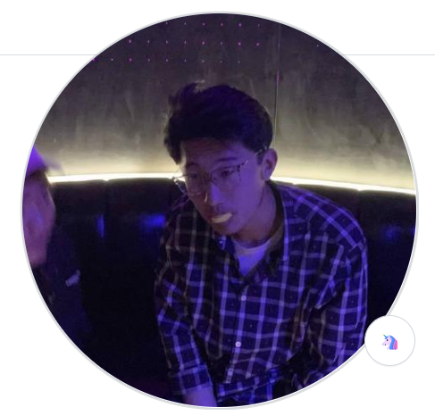  </a> <a href="https://github.com/liucongg"> 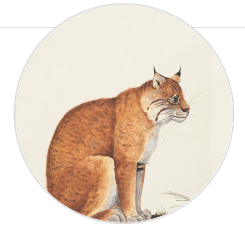  </a> <a href="https://github.com/yqy2001"> 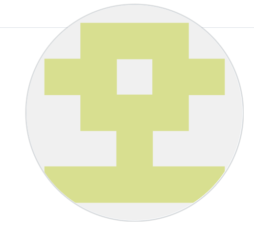  </a> <a href="https://github.com/Aleafy"> 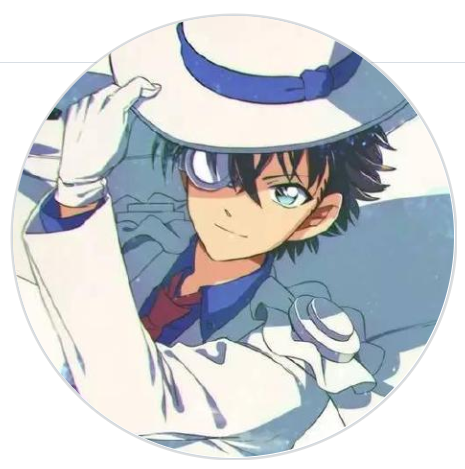  </a> <a href="https://github.com/ClarifiedfishLee"> 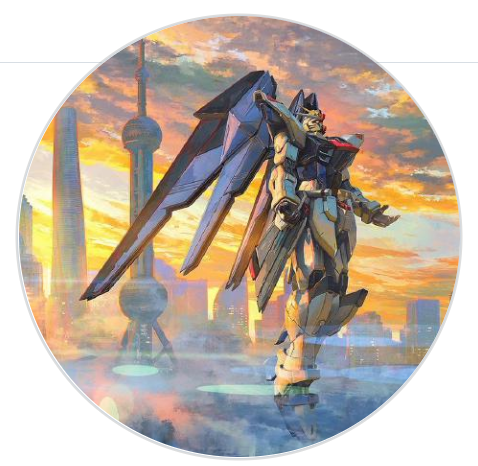  </a>  <a href="https://github.com/EcolesYee"> 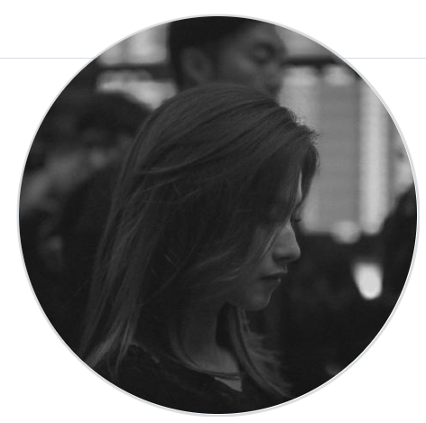  </a> <a href="https://github.com/having-salt"> 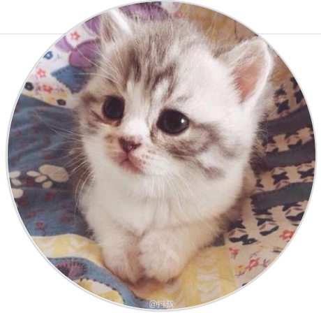  </a> <a href="https://github.com/huybery"> 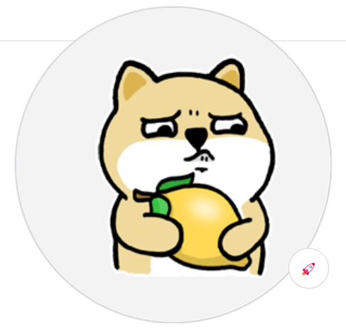  </a> <a href="https://github.com/fghccv"> 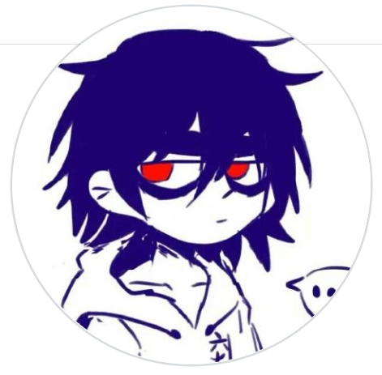  </a>   <a href="https://github.com/kokolerk"> 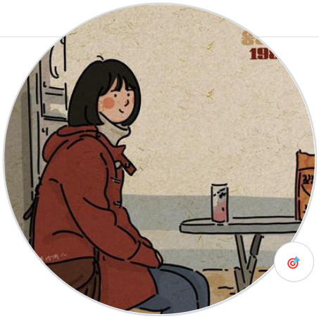  </a> <a href="https://github.com/cs-wangfeng"> 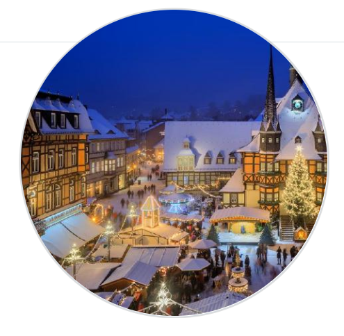  </a> <a href="https://github.com/LightChen233"> 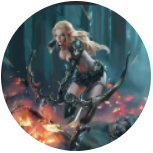  </a> <a href="https://github.com/chase6666"> 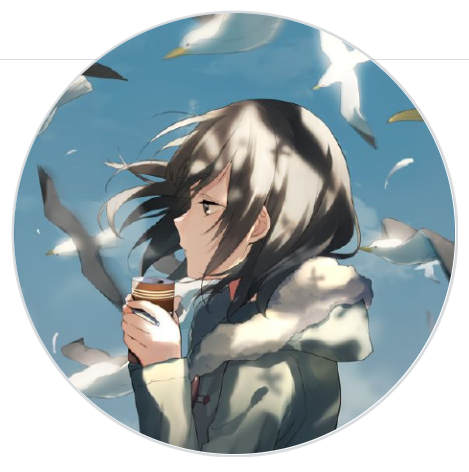  </a>

##  Acknowledgement

Special thanks to [Prof. Wanxiang Che](http://ir.hit.edu.cn/~car/english.htm) for his guidance and support!

