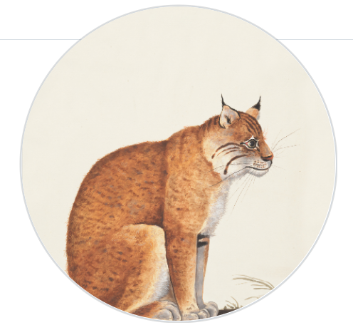
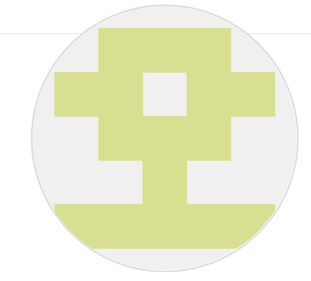
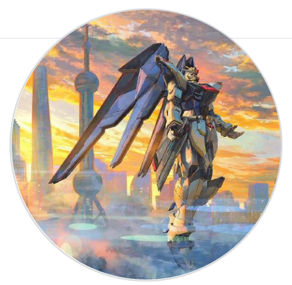
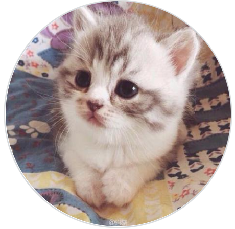
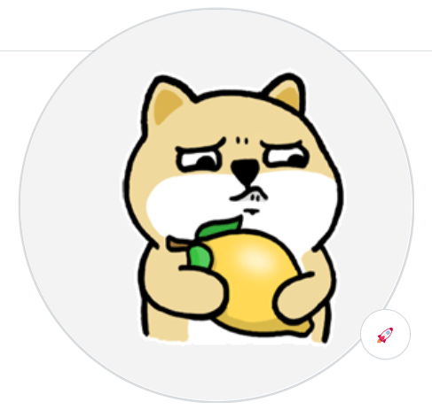
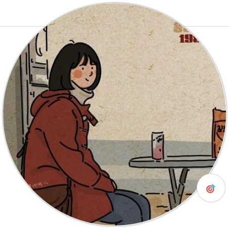
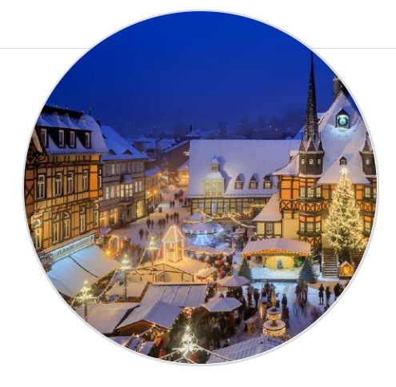
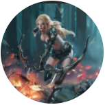
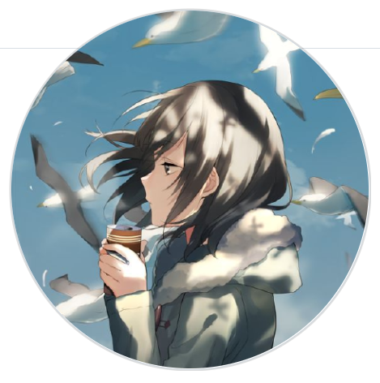
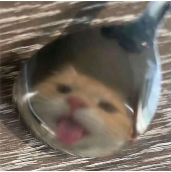

  <h2 align="center">
    
      Top-AI-Conferences-Paper-with-Code
  </h2>

  	
  
  
   	
  	
    
     

##  Motivation

本仓库收集了 AI 顶会论文及其 **开源代码资源**，包括 ACL、EMNLP、NAACL、COLING、AAAI、IJCAI、ICLR、NeurIPS 和 ICML 等会议。

众所周知，论文篇幅有限，通常很难覆盖全部实现细节。配套开源代码能提供更多可复现信息，也更方便后续跟进与复现。我们将这些论文整理出来，便于检索与参考。

##  更新记录
- **2026.7.2** 整理并更新 README，补充 `2026` 年份入口与中文说明。
- **2026.7.1** 更新 ICLR 论文与代码整理，新增 [ICLR2025](https://github.com/MLNLP-World/Top-AI-Conferences-Paper-with-Code/blob/master/ICLR/2025/ICLR2025.md) 与 [ICLR2026](https://github.com/MLNLP-World/Top-AI-Conferences-Paper-with-Code/blob/master/ICLR/2026/ICLR2026.md)。

##  贡献说明

欢迎贡献内容，也欢迎通过 issue 或 Pull Request 提交补充与修正。

##  已支持会议
| 会议 | 2019 | 2020 | 2021 | 2022 | 2023 | 2024 | 2025 | 2026 |
| ---------- | :--: | :--: | :--: | :--: | :--: | :--: | :--: | :--: |
| ACL        | [2019](https://github.com/MLNLP-World/Top-AI-Conferences-Paper-with-Code/blob/master/ACL/2019/ACL2019.md) | [2020](https://github.com/MLNLP-World/Top-AI-Conferences-Paper-with-Code/blob/master/ACL/2020/ACL2020.md) | [2021](https://github.com/MLNLP-World/Top-AI-Conferences-Paper-with-Code/blob/master/ACL/2021/ACL2021.md) | [2022](https://github.com/MLNLP-World/Top-AI-Conferences-Paper-with-Code/blob/master/ACL/2022/ACL2022.md) | [2023](https://github.com/MLNLP-World/Top-AI-Conferences-Paper-with-Code/blob/master/ACL/2023/ACL2023.md) | [2024](https://github.com/MLNLP-World/Top-AI-Conferences-Paper-with-Code/blob/master/ACL/2024/ACL2024.md) | [2025](https://github.com/MLNLP-World/Top-AI-Conferences-Paper-with-Code/blob/master/ACL/2025/ACL2025.md) | - |
| EMNLP      | [2019](https://github.com/MLNLP-World/Top-AI-Conferences-Paper-with-Code/blob/master/EMNLP/2019/EMNLP2019.md) | [2020](https://github.com/MLNLP-World/Top-AI-Conferences-Paper-with-Code/blob/master/EMNLP/2020/EMNLP2020.md) | [2021](https://github.com/MLNLP-World/Top-AI-Conferences-Paper-with-Code/blob/master/EMNLP/2021/EMNLP2021.md) | [2022](https://github.com/MLNLP-World/Top-AI-Conferences-Paper-with-Code/blob/master/EMNLP/2022/EMNLP2022.md) | [2023](https://github.com/MLNLP-World/Top-AI-Conferences-Paper-with-Code/blob/master/EMNLP/2023/EMNLP2023.md) | [2024](https://github.com/MLNLP-World/Top-AI-Conferences-Paper-with-Code/blob/master/EMNLP/2024/EMNLP2024.md) | [2025](https://github.com/MLNLP-World/Top-AI-Conferences-Paper-with-Code/blob/master/EMNLP/2025/EMNLP2025.md) | - |
| NAACL      | [2019](https://github.com/MLNLP-World/Top-AI-Conferences-Paper-with-Code/blob/master/NAACL/2019/naacl-2019.md) | - | [2021](https://github.com/MLNLP-World/Top-AI-Conferences-Paper-with-Code/blob/master/NAACL/2021/naacl-2021.md) | [2022](https://github.com/MLNLP-World/Top-AI-Conferences-Paper-with-Code/blob/master/NAACL/2022/NAACL2022.md) | - | [2024](https://github.com/MLNLP-World/Top-AI-Conferences-Paper-with-Code/blob/master/NAACL/2024/NAACL2024.md) | [2025](https://github.com/MLNLP-World/Top-AI-Conferences-Paper-with-Code/blob/master/NAACL/2025/NAACL2025.md) | - |
| COLING     | [2018](https://github.com/MLNLP-World/Top-AI-Conferences-Paper-with-Code/blob/master/COLING/2018/COLING2018.md) | [2020](https://github.com/MLNLP-World/Top-AI-Conferences-Paper-with-Code/blob/master/COLING/2020/COLING2020.md) | - | [2022](https://github.com/MLNLP-World/Top-AI-Conferences-Paper-with-Code/blob/master/COLING/2022/COLING2022.md) | - | [2024](https://github.com/MLNLP-World/Top-AI-Conferences-Paper-with-Code/blob/master/COLING/2024/COLING2024.md) | [2025](https://github.com/MLNLP-World/Top-AI-Conferences-Paper-with-Code/blob/master/COLING/2025/COLING2025.md) | - |
| AAAI       | [2019](https://github.com/MLNLP-World/Top-AI-Conferences-Paper-with-Code/blob/master/AAAI/2019/AAAI2019.md) | [2020](https://github.com/MLNLP-World/Top-AI-Conferences-Paper-with-Code/blob/master/AAAI/2020/AAAI2020.md) | [2021](https://github.com/MLNLP-World/NLP-Conferences-Code/blob/master/AAAI/2021/AAAI2021.md) | [2022](https://github.com/MLNLP-World/Top-AI-Conferences-Paper-with-Code/blob/master/AAAI/2022/AAAI2022.md) | [2023](https://github.com/MLNLP-World/Top-AI-Conferences-Paper-with-Code/blob/master/AAAI/2023/AAAI2023.md) | [2024](https://github.com/MLNLP-World/Top-AI-Conferences-Paper-with-Code/blob/master/AAAI/2024/AAAI2024.md) | [2025](https://github.com/MLNLP-World/Top-AI-Conferences-Paper-with-Code/blob/master/AAAI/2025/AAAI2025.md) | - |
| IJCAI      | [2019](https://github.com/MLNLP-World/Top-AI-Conferences-Paper-with-Code/blob/master/IJCAI/2019/IJCAI2019.md) | [2020](https://github.com/MLNLP-World/Top-AI-Conferences-Paper-with-Code/blob/master/IJCAI/2020/IJCAI2020.md) | [2021](https://github.com/MLNLP-World/Top-AI-Conferences-Paper-with-Code/blob/master/IJCAI/2021/IJCAI2021.md) | [2022](https://github.com/MLNLP-World/Top-AI-Conferences-Paper-with-Code/blob/master/IJCAI/2022/IJCAI2022.md) | [2023](https://github.com/MLNLP-World/Top-AI-Conferences-Paper-with-Code/blob/master/IJCAI/2023/IJCAI2023.md) | [2024](https://github.com/MLNLP-World/Top-AI-Conferences-Paper-with-Code/blob/master/IJCAI/2024/IJCAI2024.md) | [2025](https://github.com/MLNLP-World/Top-AI-Conferences-Paper-with-Code/blob/master/IJCAI/2025/IJCAI2025.md) | - |
| ICLR       | [2019](https://github.com/MLNLP-World/Top-AI-Conferences-Paper-with-Code/blob/master/ICLR/2019/ICLR2019.md) | [2020](https://github.com/MLNLP-World/Top-AI-Conferences-Paper-with-Code/blob/master/ICLR/2020/ICLR2020.md) | [2021](https://github.com/MLNLP-World/Top-AI-Conferences-Paper-with-Code/blob/master/ICLR/2021/ICLR2021.md) | [2022](https://github.com/MLNLP-World/Top-AI-Conferences-Paper-with-Code/blob/master/ICLR/2022/ICLR2022.md) | [2023](https://github.com/MLNLP-World/Top-AI-Conferences-Paper-with-Code/blob/master/ICLR/2023/ICLR2023.md) | [2024](https://github.com/MLNLP-World/Top-AI-Conferences-Paper-with-Code/blob/master/ICLR/2024/ICLR2024.md) | [2025](https://github.com/MLNLP-World/Top-AI-Conferences-Paper-with-Code/blob/master/ICLR/2025/ICLR2025.md) | [2026](https://github.com/MLNLP-World/Top-AI-Conferences-Paper-with-Code/blob/master/ICLR/2026/ICLR2026.md) |
| NeurIPS    | [2019](https://github.com/MLNLP-World/Top-AI-Conferences-Paper-with-Code/blob/master/NeurIPS/2019/NeurIPS2019.md) | [2020](https://github.com/MLNLP-World/Top-AI-Conferences-Paper-with-Code/blob/master/NeurIPS/2020/NeurIPS2020.md) | [2021](https://github.com/MLNLP-World/Top-AI-Conferences-Paper-with-Code/blob/master/NeurIPS/2021/NeurIPS2021.md) | 2022 | 2023 | 2024 | 2025 | - |
| ICML       | [2019](https://github.com/MLNLP-World/Top-AI-Conferences-Paper-with-Code/blob/master/ICML/2019/ICML2019.md) | [2020](https://github.com/MLNLP-World/Top-AI-Conferences-Paper-with-Code/blob/master/ICML/2020/ICML2020.md) | 2021 | 2022 | 2023 | 2024 | 2025 | - |

##  免责声明

部分结果来源于 [DBLP](https://dblp.org/)、[ACL](https://aclanthology.org/)、[NIPS](https://papers.nips.cc/)、[OpenReview](https://openreview.net/) 和 [paperwithcode](https://paperswithcode.com/)。如有版权问题，请随时联系我们，我们会尽快删除相关内容，谢谢。

##  贡献者
感谢以下贡献者：

                    

<!-- ##  Acknowledgement

Special thanks to [Prof. Wanxiang Che](http://ir.hit.edu.cn/~car/english.htm) for his guidance and support! -->

